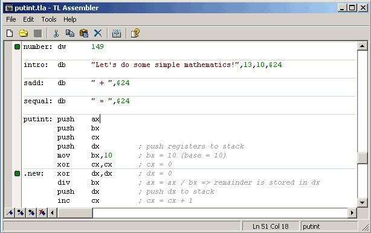



## TL Assembler Version 1\.0

### Description

A complete x86-16 assembler - the first on Planet-Source-Code! This is a fully working assembler and disassembler with an integrated development environment. Everything is made by me, even the editor controls for the assembler and the disassembler. Subclassing lets you use the mouse scroll (if you have) in the controls and gives you menu descriptions in the statusbar. Well, it's nothing more to say, just try it out and tell me what you think (note! this is an assembler, so for those who don't know how to program in assemblers: it's a bit hard to learn, but when you first learn it, nothing is impossible...) I better metion the comments too... I'm sorry not to have commented the code very well, but anyway you maybe learn more of it by studying the code without comments... ;) Enjoy (and please vote for me, if you want to :P)!
 
### More Info
 

             |
---                |---
**Submitted On**   |2004-01-01 19:14:58
**By**             |[Tommy Lillehagen](https://github.com/Planet-Source-Code/PSCIndex/blob/master/ByAuthor/tommy-lillehagen.md)
**Level**          |Advanced
**User Rating**    |5.0 (305 globes from 61 users)
**Compatibility**  |VB 6\.0
**Category**       |[Complete Applications](https://github.com/Planet-Source-Code/PSCIndex/blob/master/ByCategory/complete-applications__1-27.md)
**World**          |[Visual Basic](https://github.com/Planet-Source-Code/PSCIndex/blob/master/ByWorld/visual-basic.md)
**Archive File**   |[TL\_Assembl168942122004\.zip](https://github.com/Planet-Source-Code/tommy-lillehagen-tl-assembler-version-1-0__1-50714/archive/master.zip)

